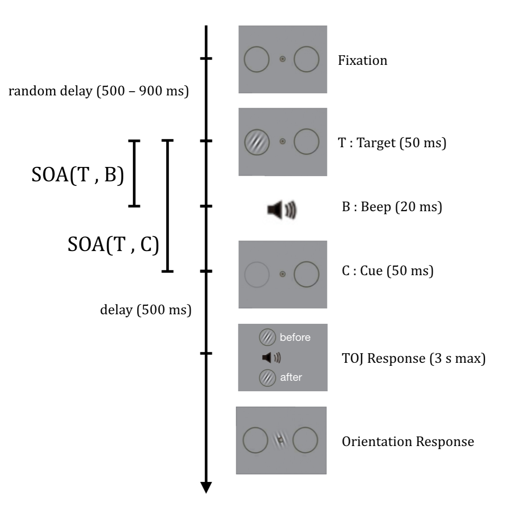

```{r setup, include=FALSE}
knitr::opts_chunk$set(echo = TRUE)
```

## Introduction

### But du projet

Le but de ce projet est de modéliser et d'analyser les prédictions faites par deux hypothèses alternatives dans une expérience.

### Description de l'expérience

L'expérience reprend le paradigme de la **rétroperception**, où l'on présente successivement une cible visuelle (target) au seuil de contraste, puis un indice d'attention spatial exogène (cue). Sergent et al. (2013) ont montré que la présence d'un indice valide peut induire une prise de conscience de la cible  qui n'aurait pas eu lieu en l'absence de l'indice, et ce jusqu'à 400 ms après l'apparition de la cible. On ajoute à ce paradigme une tâche de *Temporal Order Judgement* (TOJ), car on s'intéresse à l'effet de la rétroperception sur la perception du temps.

Chaque essai se déroule selon la séquence ci-dessous. Deux stimuli sont présentés successivement : la cible et un beep. Ils sont séparés par un intervalle de temps SOA(T, B) qui peut être positif ou négatif (lorsque cet intervalle est positif, le son est joué après la cible). Dans le code, nous y ferons référence par `soa.toBeep`. La cible peut être accompagnée ou non d’un indice (cue), qui se produit à un intervalle de temps SOA(T, C) auquel nous ferons référence par `soa.toCue`. L'écran de réponse pour la tâche de TOJ apparaît après le dernier des deux stimuli ou de l’indice. Le sujet doit sélectionner à la souris l’une des deux options : la cible est apparue “avant” ou “après” le beep.

```{r deroulement-essai, echo=FALSE, fig.cap="Déroulement d'un essai", out.width = '50%'}

```

### Hypothèses

L’objectif premier de l'expérience est de déterminer si, dans la rétroperception, il y a confusion ou indépendance du moment où l’on juge que la cible est apparue avec le moment où l’on en a pris conscience. Nous avons deux hypothèses alternatives :

**(CA)** Hypothèse *Conscious Access* : Il y a confusion du jugement du temps où la cible est apparue avec le moment où l'on a pris conscience de la cible. Ainsi, selon cette hypothèse, lors de la rétroperception, puisque l’instant où la cible accède à la conscience est retardée, la valeur du jugement temporel qui lui est attribuée est elle aussi être retardée, et ce retard est proportionnel au SOA entre la cible et l'indice.

**(TM)** Hypothèse *Time Marker* : Un processus de traitement préconscient encode un marqueur temporel de la cible qui sert de référence subjective plus tard pour juger de son moment d'apparition. Ainsi, selon cette hypothèse, l’instant où la cible est présentée ne devrait pas induire de décalage proportionnel au SOA sur le jugement temporel en moyenne.

### Types d'essais

En présence de la cue, condition que nous appellerons *avec-cue*, chaque essai a trois issues possibles : soit la cible n’a pas été perçue consciemment, soit la cible a été perçue consciemment directement suite à son apparition, soit la cible a été perçue consciemment rétrospectivement suite à l'apparition de la cue. Nous ferons référence ces trois types d’essais respectivement par *guess*, *seen*, et *retro*.

En l'absence de cue, condition que nous appellerons *no-cue*, nous n'avons que des essais de type *guess* et *seen*.

## Fonctions psychométriques composantes

Nous allons modéliser la fonction psychométrique, qui lie la probabilité que le sujet réponde que la cible est apparue avant le beep `p.beforeBeep` à l'intervalle de temps entre la cible et le beep `soa.toBeep`. 

On prédit différentes fonctions élémentaires selon la condition, le type d'essai, l'hypothèse que l'on admet, et l'intervalle de temps entre la cible et la cue. Ces fonctions nous serviront à calculer la fonction résultante où les essais sont mélangés et de type inconnu a priori.

### Helper

Afin de visualiser les fonctions psychométriques au fur et à mesure que nous les construisons, nous allons réutiliser les paramètres et la fonction helper ci-dessous :
``` {r helpers}
soa.toCue.default <- 300
soa.toBeep.levels <- seq(-600, 600, by=5)
model.CA <- list(
  name = "CA",
  color = "blue"
)
model.TM <- list(
  name = "TM",
  color = "green"
)

plot.function <- function(p.function, color, title, subtitle="") {
  plot(soa.toBeep.levels, p.function(soa.toBeep.levels),
       type="l",
       xlab="SOA[target-beep] (ms)", ylab="P(\"T < B\")",
       ylim=c(0,1),
       col=color,
       main=title)
  mtext(subtitle)
}
```

### Composantes pour chaque type d'essai

Lors d’un essai *guess*, on s’attend à ce que le sujet réponde au hasard : la fonction psychométrique est constante, à une valeur de 50% en supposant un biais nul :
```{r p.beforeBeep.guess}
p.beforeBeep.guess <- function(soa.toBeep) {
  rep(0.5, length(soa.toBeep)) # assuming no bias
}
```

``` {r component.guess.plot}
plot.function(p.beforeBeep.guess, "black", "Guess")
```

Lors d’un essai *seen*, on s’attend à une distribution similaire à celle observée dans une tâche simple de TOJ audio-visuelle. En s’inspirant de la méthode de Hanson et al. (2008), on modélise la fonction psychométrique selon une fonction logistique de la forme : 
``` {r logistic.function}
logistic <- function(x, mu = 0, teta = 1) {
  1 / (1 + exp(-(x - mu) / teta))
}
```
où `μ` est le point de simultanéité subjective (`pss`), et `teta` la pente (équivalente au `jnd` pour just noticeable difference). On prend les valeurs ci-dessous d'après (Fujisaki et al., 2004; Hanson et al., 2008) :
``` {r component.seen.parameters}
pss.toBeep.seen <- -10
jnd.toBeep.seen <- 30
```
Ainsi : 
```{r p.beforeBeep.seen}
p.beforeBeep.seen <- function(soa.toBeep) {
  logistic(soa.toBeep, pss.toBeep.seen, jnd.toBeep.seen)
}
```
``` {r.component.seen.plot}
plot.function(p.beforeBeep.seen, "black", "Seen")
```

Lors d’un essai *retro*, le `pss` que l’on prédit diffère selon l’hypothèse dans laquelle on se place : selon (CA), il serait proche du temps de la cue, selon (TM), il serait proche du temps du beep.
``` {r pss.toBeep.retro}
pss.toBeep.retro <- function(soa.toCue = 0, model) {
  if (model$name == model.CA$name) { # Conscious Access Model: PSS close to cue
    pss.toBeep.seen + soa.toCue
  } else if (model$name == model.TM$name) { # Time Marker Model: PSS close to beep
    pss.toBeep.seen # constant
  } 
}
```
Pour la `jnd`, dans les deux hypothèses, on prédit que le déclin de la trace sensorielle de la cible récupérée à l’apparition de la cue cause une diminution de la précision et donc du `jnd` par rapport à un essai seen, diminution d’autant plus grande que l'intervalle de temps entre les deux `soa.toCue` est grand.
``` {r jnd.toBeep.retro}
jnd.toBeep.retro <- function(soa.toCue = 0, model) {
  jnd.toBeep.seen + soa.toCue / 10 # lower precision due to the degradation of the sensory memory trace over time
}
```
Ceci nous donne deux fonctions psychométriques différentes pour les essais *retro* selon l'hypothèse, paramétrées en fonction de `soa.toCue`, comme illustré ci-dessous.
``` {r.p.beforeBeep.retro}
p.beforeBeep.retro <- function(soa.toBeep, soa.toCue = 0, model) {
  pss <- pss.toBeep.retro(soa.toCue, model)
  jnd <- jnd.toBeep.retro(soa.toCue, model)
  logistic(soa.toBeep, pss, jnd)
}
```

``` {r.component.retro.plot.helper}
plot.function.retro <- function(model, soa.toCue=soa.toCue.default) {
  p.function.retro <- function(soa.toBeep) { p.beforeBeep.retro(soa.toBeep, soa.toCue, model) }
  title <- sprintf("Retro - %s", model$name, soa.toCue)
  subtitle <- sprintf("SOA[target-cue] = %d ms", soa.toCue)
  plot.function(p.function.retro, model$color, title, subtitle)
}
```

``` {r.component.retro.plot}
plot.function.retro(model.CA, 100)
plot.function.retro(model.CA, 300)
plot.function.retro(model.TM, 100)
plot.function.retro(model.TM, 300)
```

## Fonctions psychométriques résultantes : Mixture Model

On modélise les fonctions psychométriques résultantes par une distribution de mélange résultant de la combinaison des composantes décrites ci-dessus, pondérée par les probabilités de chaque type d’essai. Pour calculer ces probabilités, on se base sur les résultats de l'expérience de rétroperception déjà menée par Thibault, Sergent et al. (2016).

En condition *no-cue*, le seuil de contraste qu'on utilise (déterminé par une procédure d'escalier préliminaire) donne une probabilité de 0.55 de voir consciemment la cible, ce qui nous donne directement les probabilités qu'un essai soit de type guess ou de type seen :
``` {r p.trials.nocue}
p.seen.nocue <- 0.55
p.trials.nocue <- list(guess = 1 - p.seen.nocue, seen = p.seen.nocue)
```

En condition *avec-cue*, la probabilité de voir consciemment la cible dépend de l'intervalle de temps entre target et cue. On interpole les données obtenues expérimentalement pour obtenir la probabilité qu'un essai `p.guess` soit de type guess en fonction de `soa.toCue`, et on en déduit les autres probabilités comme suit :
``` {r p.trials}
p.guess <- function(soa.toCue) {
  # data from Sergent_Thibault_et_al 2016 PLOS
  data.soa.toCue <- c(-100, 100, 400)
  data.p.guess <-  c(0.24, 0.32, 0.39)
  # linear interpolation of data points
  approxfun(data.soa.toCue, data.p.guess, rule=2)(soa.toCue)
}

p.trials <- function(soa.toCue) {
  p.g <- p.guess(soa.toCue)
  if (soa.toCue >= 0) {
    ## lorsque la cue apparaît après la cible, la probabilité p.seen est la même qu'en condition no-cue, car la cue ne peut avoir qu'un effet rétrospectif qui se répercute sur p.retro
    p.seen <- p.seen.nocue
    p.retro <- 1 - p.g - p.seen
  } else {
    ## lorsque la cue apparaît avant la cible, on a, par définition, pas de retro
    p.seen <- 1 - p.g
    p.retro <- 0
  }
  list(guess = p.g, seen = p.seen, retro = p.retro)
}
```

Pour la condition *no-cue*, cela donne la résultante :
``` {r p.beforeBeep.mixture.nocue}
p.beforeBeep.mixture.nocue <- function(soa.toBeep) {
  proportions <- p.trials.nocue
  proportions$guess * p.beforeBeep.guess(soa.toBeep) +
  proportions$seen * p.beforeBeep.seen(soa.toBeep)
}
```

``` {r plot.function.mixture.nocue}
plot.function(p.beforeBeep.mixture.nocue, "black", "Mixture - no-cue")
```

Pour la condition *avec-cue*, cela donne la résultante :
``` {r p.function.mixture.cue}
p.beforeBeep.mixture <- function(soa.toBeep, soa.toCue = 0, model) {
  proportions <- p.trials(soa.toCue)
  proportions$retro * p.beforeBeep.retro(soa.toBeep, soa.toCue, model) +
  proportions$seen * p.beforeBeep.seen(soa.toBeep) +
  proportions$guess * p.beforeBeep.guess(soa.toBeep)
}
```

``` {r.plot.function.mixture.cue.helper}
plot.function.mixture <- function(model) {
  p.function.mixture <- function(soa.toBeep) { p.beforeBeep.mixture(soa.toBeep, soa.toCue.default, model) }
  title <- sprintf("Mixture - %s", model$name)
  subtitle <- sprintf("SOA[target-cue] = %d ms", soa.toCue.default)
  plot.function(p.function.mixture, model$color, title, subtitle)
}
```

``` {r.plot.function.mixture.cue}
plot.function.mixture(model.CA)
plot.function.mixture(model.TM)
```

## Comparaison des conditions avec-cue et no-cue en fonction du SOA[cue-target]

Nous allons ici comparer la fonction psychométrique de la condition avec-cue avec celle de la condition no-cue, et voir comment cette comparaison évolue en fonction du SOA[cue-target] en le modifiant de façon interactive. Ceci correspond correspond aux observations que l'on mesurerait empiriquement.

``` {r plot.comparison.helper}
plot.mixtures <- function(model, input.soa.toCue = soa.toCue.default) {
  title <- sprintf("%s Model", model$name)
  subtitle <- sprintf("SOA[target-cue] = %d ms", input.soa.toCue)
  color <- model$color
  lty <- "dashed"
  plot(soa.toBeep.levels,
       p.beforeBeep.mixture.nocue(soa.toBeep.levels),
       type="l", col="black", lty="dotted",
       xlab="SOA[target-beep] (ms)", ylab="P(\"T < B\")",
       ylim=c(0,1),
       main=title)
  lines(soa.toBeep.levels,
        p.beforeBeep.mixture(soa.toBeep.levels, soa.toCue = input.soa.toCue, model),
        col=color, lty=lty)
  mtext(subtitle)
  legend("topleft", inset=.05, lwd=2,
         c("no-cue", "with-cue"),
         col=c("black", color),
         lty=c("dotted", lty))
}
```

On utilise Shiny pour modifier le SOA[target-cue] de façon interactive et voir son effet sur les graphes.

``` {r plot.comparison.cue.nocue.interactive}
sliderInput("soa.toCue", "SOA[target-cue] (ms)", -100, 400, soa.toCue.default, step = 25, round = TRUE)

renderPlot({ plot.mixtures(model.CA, input$soa.toCue) })
renderPlot({ plot.mixtures(model.TM, input$soa.toCue) })
```

## Analyse des résultats prédits par les deux hypothèses

On voit ci-dessus que, sous l'hypothèse CA, pour les cue avec SOA[target-cue] positifs, on observe des différences entre la condition "avec-cue" et celle de la condition "no-cue" sur les mesures suivantes :

- une asymétrie en avec-cue qu'on ne retrouve pas en no-cue, qu'on peut quantifier par une mesure de *skewness*
- une saturation qui est atteinte plus tard que celle de la condition no-cue (ex. à environ 400 ms avec-cue contre 50 ms no-cue, pour un SOA de 300 ms)
- une diminution de la probabilité de réponse “T < B” dans l’intervalle [`pss.toBeep.seen` ; `pss.toBeep.seen + soa.toCue`] qu'on a pas en no-cue.

De plus, ces différences sont d'autant plus importantes que le SOA[target-cue] est grand.

Sous l'hypothèse TM, on n'observe pas de telles différences.

Ainsi, nous pourrions tester lequel des deux modèles décrit le mieux nos données en manipulant expérimentalement le SOA[target-cue], en calculant les différences de mesures entre avec-cue et no-cue et en observant leur évolution en fonction du SOA.

## Conclusion

Ce projet a été l'occasion pour moi d'apprendre R et R Markdown. Je ne les avais jamais utilisés auparavant.

L'écriture du rapport m'a forcé à rendre mon code plus lisible et plus simple, à utiliser une approche plus basée sur des structures fonctionnelles que des structures impératives (modélisation par des fonctions plutôt que par des matrices, suppression des boucles for) et à minimiser les dépendances (injection de dépendances dans les fonctions).

Cela m'a aussi appris à écrire un rapport d'analyse de données partageable qui combine code, visualisation et explications. Avant le cours de Christophe Pallier, je n'avais jamais vu de tels documents scientifiques et je ne savais pas qu'il existait des outils comme R Markdown pour les produire aussi facilement. Je trouve cela "assez génial" et j'ai hâte de les utiliser à nouveau dans mes recherches ! :-)

